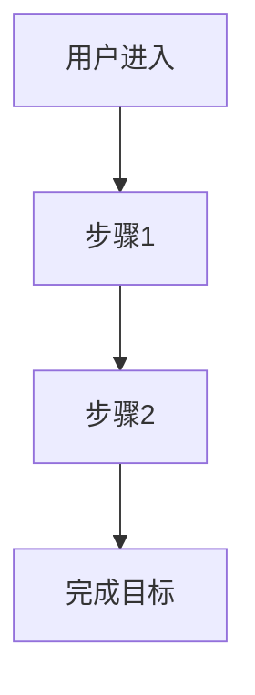

# 需求工作流Agent - 产品需求文档 v2.0

## 文档信息
- **文档版本**: v2.0
- **创建日期**: 2026-03-31
- **更新依据**: 合伙人周杰的大厂经验 + 需求工作流设计说明
- **产品经理**: 乔军
- **所属项目**: One-Click Dev
- **功能定位**: 面向产品团队的需求流转与方案生成工作流Agent

## 1. 产品重新定位

### 1.1 问题识别
产品团队的真实痛点：
- **需求来源分散**：运营、客服、上级、产品自驱多渠道
- **需求表达模糊**：一句话需求，缺乏场景和约束
- **价值判断困难**：缺乏统一评估标准，主观性强
- **优先级争论多**：会议时间长，决策效率低
- **文档质量不一**：PRD写完后难以复用和闭环

### 1.2 解决方案
不是"自动写PRD工具"，而是**需求流转与方案生成工作流Agent**：
- **标准化输入**：把零散需求变成可处理对象
- **自动化分析**：基于规则和AI进行价值评估
- **可决策输出**：提供优先级推荐和方案建议
- **闭环管理**：需求池长期管理，上线后复盘回流

### 1.3 目标用户
- **产品经理**：迭代需求分析，优先级排序，文档生成
- **运营人员**：需求提报，价值初步评估
- **技术负责人**：技术可行性评估，资源规划
- **业务负责人**：需求审批，战略对齐

## 2. 核心工作流（MVP版本）

### 2.1 Step 1：需求入口采集
**输入**：
- 一句话需求描述
- 业务背景（可选）
- 来源角色（运营/客服/上级/产品）

**输出**：
- 标准化需求卡片
- 待澄清问题列表

**功能设计**：
```javascript
// 需求卡片结构
{
  "id": "REQ-001",
  "title": "需求标题",
  "description": "一句话描述",
  "source": "运营/客服/上级/产品",
  "type": "新增/优化/修复",
  "module": "所属业务模块",
  "created_at": "2026-03-31",
  "status": "待澄清"
}
```

### 2.2 Step 2：需求澄清
**输入**：标准化需求卡片

**输出**：
- 完整场景描述
- 明确问题定义
- 指标影响假设
- 约束条件识别

**澄清问题模板**：
1. **场景澄清**：这个需求发生在什么具体业务场景？
2. **用户澄清**：影响哪个用户角色？用户当前如何操作？
3. **问题澄清**：要解决的具体问题是什么？用户痛点是什么？
4. **目标澄清**：期望达成什么业务目标？如何衡量成功？
5. **约束澄清**：是否有时间、资源、技术、合规约束？

### 2.3 Step 3：需求池管理
**输入**：澄清后的需求

**输出**：
- 需求池记录
- 状态标签（待分析/已分析/已排期/已上线）
- 相似需求提示
- 需求合并建议

**需求池功能**：
- **去重合并**：识别相似需求，建议合并
- **分类标签**：按模块、类型、优先级分类
- **状态流转**：需求生命周期管理
- **历史追溯**：需求变更记录和版本管理

### 2.4 Step 4：商业价值分析
**输入**：
- 需求描述
- 目标指标
- 历史需求上下文
- 业务数据（如有）

**输出**：
- **价值判断**：高/中/低价值
- **指标影响路径**：用户行为 → 指标变化
- **置信度评估**：高/中/低置信度
- **风险与前提**：依赖条件和风险点

**具体影响指标**：
```json
{
  "user_metrics": {
    "dau": {
      "current": "当前DAU",
      "expected_change": "预期变化",
      "confidence": "置信度"
    },
    "mau": {
      "current": "当前MAU",
      "expected_change": "预期变化",
      "confidence": "置信度"
    },
    "retention": {
      "day_1": "次日留存",
      "day_7": "7日留存",
      "day_30": "30日留存",
      "expected_improvement": "预期提升"
    }
  },
  "business_metrics": {
    "revenue": {
      "arpu": "用户平均收入",
      "expected_increase": "预期增加",
      "confidence": "置信度"
    },
    "ad_performance": {
      "ctr": "点击率",
      "expected_improvement": "预期提升",
      "cpc": "每次点击成本",
      "expected_change": "预期变化"
    },
    "conversion": {
      "rate": "转化率",
      "expected_improvement": "预期提升"
    }
  }
}
```

### 2.5 Step 5：优先级推荐
**输入**：
- 价值分析结果
- 复杂度评估
- 业务约束
- 战略匹配度

**输出**：
- **推荐优先级**：P0/P1/P2/P3
- **排序理由**：价值、成本、风险、战略匹配度
- **争议点标记**：需要人工决策的事项
- **人工确认项**：建议人工复核的内容

**优先级算法**：
```
优先级分数 = 价值评分 × 0.4 + 战略匹配度 × 0.3 + (1/复杂度) × 0.2 + 风险系数 × 0.1

P0: 分数 ≥ 8.0（高价值、低复杂度、战略匹配）
P1: 6.0 ≤ 分数 < 8.0
P2: 4.0 ≤ 分数 < 6.0
P3: 分数 < 4.0
```

### 2.6 Step 6：需求分析文档生成
**输入**：
- 需求卡片
- 价值分析结果
- 优先级推荐
- 用户故事

**输出**：需求分析文档（替代传统PRD）

## 3. 需求分析文档模板

### 3.1 文档结构
```markdown
# [需求标题] - 需求分析文档

## 1. 需求概述
- **需求ID**: REQ-001
- **需求类型**: [新增/优化/修复]
- **业务场景**: [具体场景描述]
- **影响模块**: [模块名称]
- **来源**: [运营/客服/上级/产品自驱]
- **提出时间**: 2026-03-31

## 2. 用户故事
### 2.1 核心用户故事
**作为** [用户角色]
**我想要** [完成什么任务]
**以便** [达成什么目标]

### 2.2 验收标准
- [标准1]: [具体描述]
- [标准2]: [具体描述]
- [标准3]: [具体描述]

### 2.3 用户流程


## 3. 价值分析
### 3.1 核心指标影响
| 指标 | 当前值 | 预期变化 | 置信度 | 影响路径 |
|------|--------|----------|--------|----------|
| DAU | 10,000 | +5% | 高 | 功能优化 → 使用频率增加 |
| 7日留存 | 20% | +2% | 中 | 体验改善 → 用户粘性提升 |
| 广告CTR | 2.5% | +0.5% | 中 | 界面优化 → 点击意愿增强 |
| 复购率 | 15% | +3% | 低 | 功能完善 → 用户满意度提升 |

### 3.2 商业价值
- **收入影响**: 预期月增加 ¥50,000
- **成本影响**: 开发成本 ¥20,000，运营成本 ¥5,000/月
- **ROI**: 预期3个月回本
- **战略价值**: 提升用户粘性，增强竞争优势

### 3.3 风险与前提
- **技术风险**: [风险描述，如技术实现难度]
- **运营风险**: [风险描述，如用户接受度]
- **依赖前提**: [前提条件，如需要XX数据支持]
- **合规风险**: [合规要求，如数据隐私]

## 4. SEO需求分析
### 4.1 页面SEO优化
- **标题标签**: [建议标题，50-60字符]
- **Meta描述**: [建议描述，150-160字符]
- **URL结构**: /module/feature-name
- **H1标签**: [页面主标题]
- **图片优化**: alt文本、压缩、WebP格式

### 4.2 内容SEO
- **核心关键词**: [关键词1, 关键词2]
- **内容长度**: 建议800-1500字
- **原创性要求**: >90%
- **内部链接**: 链接到[相关页面1]、[相关页面2]
- **外部链接**: 引用[权威来源1]、[权威来源2]

### 4.3 技术SEO
- **页面速度**: LCP < 2.5s, FID < 100ms, CLS < 0.1
- **移动友好**: 响应式设计，触摸目标>44px
- **结构化数据**: [建议Schema类型]
- **核心Web指标**: 监控和优化建议

## 5. 优先级推荐
### 5.1 推荐优先级: P[0-3]
**评分详情**:
- 价值评分: 8/10
- 复杂度评分: 6/10（中等复杂度）
- 战略匹配度: 9/10（高度匹配战略）
- 风险系数: 3/10（低风险）
- **综合得分**: 7.5/10 → **P1优先级**

### 5.2 排序理由
1. **高价值**: 预期显著提升核心指标
2. **战略匹配**: 符合产品长期发展方向
3. **中等复杂度**: 技术实现可行
4. **低风险**: 无明显技术和运营风险

### 5.3 争议点
- [需要人工决策的事项，如资源冲突]
- [依赖条件，如需要XX团队配合]
- [不确定性，如用户接受度未知]

## 6. 实施建议
### 6.1 技术方案
- **前端**: [技术栈建议]
- **后端**: [架构设计]
- **数据库**: [数据模型]
- **接口**: [API设计]

### 6.2 资源需求
- **开发**: [2人×2周]
- **设计**: [1人×1周]
- **测试**: [1人×1周]
- **产品**: [0.5人×2周]

### 6.3 上线计划
- **开发周期**: 2周
- **测试周期**: 1周
- **建议上线时间**: 2026-04-15
- **A/B测试**: [测试方案，如50%流量]
- **监控指标**: [上线后监控的核心指标]
- **回滚计划**: [异常情况处理方案]

## 7. 相关需求
### 7.1 相似需求
- [相似需求1]: [简要描述]
- [相似需求2]: [简要描述]

### 7.2 依赖需求
- [前置需求]: [需要先完成的需求]
- [并行需求]: [可以同时进行的需求]
- [后续需求]: [完成后可以开展的需求]

---

## 8. 附录
### 8.1 数据来源
- [数据来源1]: [数据描述]
- [数据来源2]: [数据描述]

### 8.2 参考文档
- [参考文档1]: [文档链接]
- [参考文档2]: [文档链接]

### 8.3 修订历史
| 版本 | 日期 | 修改内容 | 修改人 |
|------|------|---------|--------|
| v1.0 | 2026-03-31 | 初始版本 | 系统生成 |
| v1.1 | 2026-04-01 | 根据评审反馈更新 | [修改人] |
```

### 3.2 文档特点
- **轻量高效**：聚焦分析，不写冗长PRD
- **数据驱动**：基于指标的价值评估
- **SEO集成**：每个需求都考虑SEO影响
- **可决策**：明确的优先级推荐和实施建议
- **可复用**：结构化格式，便于团队协作

## 4. 设计原则

### 4.1 用户故事驱动
**原则**：每个需求都必须有明确的用户故事

**实施**：
1. **角色定义**：明确影响哪个用户角色
2. **场景描述**：在什么情况下使用
3. **目标明确**：用户想要达成什么
4. **价值清晰**：对用户和业务的价值

**示例**：
```
**作为** 电商平台的运营人员
**我想要** 批量修改商品价格
**以便** 在促销活动时快速调整价格，提高运营效率

**验收标准**：
- 支持Excel文件导入
- 批量修改成功率 > 99%
- 修改后实时生效
- 提供修改日志和回滚功能
```

### 4.2 指标具体化
**原则**：价值评估必须基于具体指标

**核心指标库**：
```yaml
用户指标:
  - DAU: 日活跃用户数
  - MAU: 月活跃用户数
  - 留存率: 次日/7日/30日留存
  - 使用时长: 平均使用时间
  - 功能使用率: 特定功能使用比例

业务指标:
  - 收入: GMV、ARPU、复购率
  - 转化率: 注册转化、购买转化
  - 成本: CAC、运营成本
  - 效率: 人工节省、处理时间

内容指标:
  - SEO流量: 自然搜索流量
  - 页面质量: 跳出率、停留时间
  - 分享率: 内容分享次数
  - 互动率: 评论、点赞、收藏
```

### 4.3 SEO需求集成
**原则**：每个页面级需求都必须考虑SEO

**SEO检查清单**：
```markdown
## SEO需求检查清单

### 页面基础SEO
- [ ] 标题标签优化（50-60字符）
- [ ] Meta描述优化（150-160字符）
- [ ] URL结构优化（简洁、含关键词）
- [ ] H1标签唯一且含关键词
- [ ] 图片alt文本优化

### 内容SEO
- [ ] 核心关键词识别和布局
- [ ] 内容长度和质量达标
- [ ] 内部链接结构合理
- [ ] 外部链接引用权威来源
- [ ] 结构化数据标记

### 技术SEO
- [ ] 页面速度优化（LCP、FID、CLS）
- [ ] 移动友好性测试
- [ ] 核心Web指标监控
- [ ] 404页面处理
- [ ] 站点地图更新
```

## 5. 技术实现

### 5.1 系统架构
```
┌─────────────────┐    ┌─────────────────┐    ┌─────────────────┐
│  需求输入层     │    │  分析处理层     │    │  输出展示层     │
│                 │    │                 │    │                 │
│ • 表单输入      │───▶│ • 需求澄清      │───▶│ • 需求分析文档  │
│ • 对话式输入    │    │ • 价值分析      │    │ • 优先级看板    │
│ • 文件导入      │    │ • SEO分析       │    │ • 数据可视化    │
│ • API接入       │    │ • 优先级计算    │    │ • 导出功能      │
└─────────────────┘    └─────────────────┘    └─────────────────┘
         │                        │                        │
         └────────────────────────┼────────────────────────┘
                                  │
                         ┌─────────────────┐
                         │  数据存储层     │
                         │                 │
                         │ • 需求池数据库  │
                         │ • 指标数据库    │
                         │ • 用户行为数据  │
                         │ • SEO数据       │
                         └─────────────────┘
```

### 5.2 核心算法

#### 5.2.1 价值评分算法
```python
def calculate_value_score(demand):
    # 用户价值评分（0-10）
    user_value = (
        demand.expected_dau_impact * 0.3 +
        demand.expected_retention_impact * 0.3 +
        demand.expected_usage_time_impact * 0.2 +
        demand.user_satisfaction_impact * 0.2
    )
    
    # 商业价值评分（0-10）
    business_value = (
        demand.expected_revenue_impact * 0.4 +
        demand.expected_cost_reduction * 0.3 +
        demand.strategic_alignment * 0.3
    )
    
    # SEO价值评分（0-10）
    seo_value = (
        demand.expected_seo_traffic * 0.5 +
        demand.content_quality * 0.3 +
        demand.technical_seo_impact * 0.2
    )
    
    # 综合价值评分
    total_value = (
        user_value * 0.4 +
        business_value * 0.4 +
        seo_value * 0.2
    )
    
    return {
        "total": round(total_value, 1),
        "user_value": round(user_value, 1),
        "business_value": round(business_value, 1),
        "seo_value": round(seo_value, 1)
    }
```

#### 5.2.2 优先级算法
```python
def calculate_priority(demand):
    value_score = demand.value_score["total"]
    complexity_score = 10 - demand.estimated_complexity  # 复杂度越低越好
    risk_score = 10 - demand.risk_level * 2  # 风险越低越好
    strategic_score = demand.strategic_alignment
    
    # 优先级分数
    priority_score = (
        value_score * 0.4 +
        strategic_score * 0.3 +
        complexity_score * 0.2 +
        risk_score * 0.1
    )
    
    # 优先级分类
    if priority_score >= 8.0:
        priority = "P0"
    elif priority_score >= 6.0:
        priority = "P1"
    elif priority_score >= 4.0:
        priority = "P2"
    else:
        priority = "P3"
    
    return {
        "priority": priority,
        "score": round(priority_score, 1),
        "breakdown": {
            "value": value_score,
            "complexity": complexity_score,
            "risk": risk_score,
            "strategic": strategic_score
        }
    }
```

### 5.3 API设计

#### 5.3.1 核心API端点
```javascript
// 需求提交
POST /api/v1/demands
{
  "title": "需求标题",
  "description": "需求描述",
  "source": "运营",
  "type": "优化"
}

// 需求分析
POST /api/v1/demands/:id/analyze
{
  // 自动分析需求价值
}

// 获取需求分析结果
GET /api/v1/demands/:id/analysis

// 生成需求分析文档
POST /api/v1/demands/:id/generate-document

// 需求池查询
GET /api/v1/demand-pool
{
  "status": "待分析",
  "priority": "P1",
  "module": "用户中心"
}
```

#### 5.3.2 WebSocket事件
```javascript
// 分析进度通知
{
  "event": "analysis_progress",
  "data": {
    "demand_id": "REQ-001",
    "step": "价值分析",
    "progress": 60,
    "estimated_time": "30秒"
  }
}

// 分析完成通知
{
  "event": "analysis_complete",
  "data": {
    "demand_id": "REQ-001",
    "document_url": "/demands/REQ-001/document",
    "priority": "P1",
    "value_score": 7.5
  }
}
```

## 6. 数据模型

### 6.1 核心数据表

#### 6.1.1 需求表 (demands)
```sql
CREATE TABLE demands (
  id VARCHAR(20) PRIMARY KEY, -- REQ-001
  title VARCHAR(255) NOT NULL,
  description TEXT,
  source VARCHAR(50), -- 运营/客服/上级/产品
  type VARCHAR(20), -- 新增/优化/修复
  module VARCHAR(100), -- 所属模块
  status VARCHAR(20) DEFAULT '待澄清', -- 待澄清/已澄清/待分析/已分析/已排期/已上线
  priority VARCHAR(10), -- P0/P1/P2/P3
  created_at TIMESTAMP DEFAULT NOW(),
  updated_at TIMESTAMP DEFAULT NOW(),
  created_by VARCHAR(100),
  assigned_to VARCHAR(100)
);
```

#### 6.1.2 需求分析表 (demand_analysis)
```sql
CREATE TABLE demand_analysis (
  id UUID PRIMARY KEY,
  demand_id VARCHAR(20) NOT NULL,
  
  -- 用户故事
  user_story TEXT,
  acceptance_criteria JSONB,
  
  -- 价值分析
  value_score DECIMAL(3,1), -- 0-10
  user_value DECIMAL(3,1),
  business_value DECIMAL(3,1),
  seo_value DECIMAL(3,1),
  
  -- 指标影响
  metrics_impact JSONB, -- {dau: {current: 10000, expected: +5%}, ...}
  
  -- SEO分析
  seo_analysis JSONB, -- {title: "...", meta: "...", keywords: [...]}
  
  -- 优先级
  priority_score DECIMAL(3,1),
  priority_reason TEXT,
  controversy_points TEXT[],
  
  -- 实施建议
  technical_suggestion TEXT,
  resource_estimation JSONB, -- {dev: "2人×2周", design: "1人×1周"}
  timeline_suggestion TEXT,
  
  created_at TIMESTAMP DEFAULT NOW(),
  FOREIGN KEY (demand_id) REFERENCES demands(id)
);
```

#### 6.1.3 需求池视图 (demand_pool_view)
```sql
CREATE VIEW demand_pool_view AS
SELECT 
  d.id,
  d.title,
  d.source,
  d.type,
  d.module,
  d.status,
  d.priority,
  d.created_at,
  da.value_score,
  da.priority_score,
  da.metrics_impact->>'dau' as dau_impact,
  da.metrics_impact->>'retention' as retention_impact
FROM demands d
LEFT JOIN demand_analysis da ON d.id = da.demand_id
WHERE d.status NOT IN ('已上线', '已关闭')
ORDER BY 
  CASE d.priority
    WHEN 'P0' THEN 1
    WHEN 'P1' THEN 2
    WHEN 'P2' THEN 3
    WHEN 'P3' THEN 4
    ELSE 5
  END,
  da.value_score DESC;
```

## 7. 用户界面设计

### 7.1 核心页面

#### 7.1.1 需求提交页面
- **简洁表单**：标题、描述、来源、类型
- **智能提示**：基于历史需求的智能补全
- **模板选择**：常见需求模板快速填充
- **文件上传**：支持Excel、Word文档导入

#### 7.1.2 需求分析页面
- **进度展示**：6步分析过程可视化
- **实时预览**：分析结果实时展示
- **参数调整**：支持手动调整分析参数
- **多方案对比**：生成多个分析方案供选择

#### 7.1.3 需求池看板
- **卡片视图**：需求卡片按优先级排序
- **筛选过滤**：按状态、模块、来源筛选
- **拖拽排序**：支持手动调整优先级
- **批量操作**：批量分析、导出、分配

#### 7.1.4 分析文档页面
- **文档预览**：完整的需求分析文档
- **编辑功能**：支持在线编辑和批注
- **导出选项**：Markdown、PDF、Word格式
- **分享协作**：生成分享链接，支持评论

### 7.2 设计规范

#### 7.2.1 视觉设计
- **主色调**：专业蓝 (#3b82f6)
- **辅助色**：成功绿 (#10b981)、警告黄 (#f59e0b)
- **字体**：Inter + 思源黑体，清晰易读
- **间距**：基于8px的间距系统

#### 7.2.2 交互设计
- **实时反馈**：操作后立即反馈结果
- **撤销重做**：支持操作历史管理
- **快捷键**：常用操作快捷键支持
- **引导提示**：新功能引导和提示

## 8. 发布计划

### 8.1 MVP版本 (v1.0)
**时间**：4-6周
**功能**：
- 基础需求提交和澄清
- 自动化价值分析（基础指标）
- 优先级推荐算法
- 需求分析文档生成
- 基础需求池管理

**目标用户**：内部产品团队试用
**成功指标**：
- 需求分析准确率 > 80%
- 用户满意度 > 4/5
- 平均分析时间 < 5分钟

### 8.2 正式版本 (v2.0)
**时间**：MVP后8-12周
**功能**：
- 完整SEO需求分析
- 高级指标影响分析
- 多维度优先级算法
- 团队协作功能
- API开放接口

**目标用户**：公开注册，中小产品团队
**成功指标**：
- 月活跃团队 > 100
- 付费转化率 > 10%
- NPS > 50

### 8.3 企业版本 (v3.0)
**时间**：正式版后12-16周
**功能**：
- 企业级需求管理
- 自定义分析规则
- 数据集成（Jira、Confluence等）
- 高级报表和分析
- SLA保障

**目标用户**：中大型企业客户
**成功指标**：
- 企业客户 > 50
- ARR > $500k
- 客户续约率 > 90%

## 9. 成功指标

### 9.1 产品指标
- **用户增长**：月新增团队数
- **活跃度**：周活跃团队比例
- **留存率**：30日团队留存率
- **使用深度**：平均每月分析需求数

### 9.2 质量指标
- **分析准确率**：用户对分析结果的认可度
- **处理速度**：平均需求分析时间
- **系统稳定性**：服务可用性 > 99.9%
- **用户满意度**：NPS和用户评分

### 9.3 商业指标
- **收入**：月度经常性收入（MRR）
- **获客成本**：CAC
- **客户价值**：LTV
- **投资回报**：ROI

## 10. 风险与应对

### 10.1 技术风险
- **分析准确性**：建立人工审核机制，持续优化算法
- **系统性能**：实施缓存策略和负载均衡
- **数据安全**：加强数据加密和访问控制
- **集成复杂度**：提供清晰的API文档和SDK

### 10.2 市场风险
- **用户接受度**：通过免费试用和教育内容降低门槛
- **竞争压力**：专注于工作流和专业化差异化
- **定价策略**：采用灵活的SaaS定价模型
- **市场教育**：通过案例研究和行业报告教育市场

### 10.3 运营风险
- **内容质量**：建立内容质量审核机制
- **客户支持**：建立完善的支持体系和知识库
- **合规风险**：确保符合数据保护和隐私法规
- **团队能力**：加强团队培训和知识共享

---

## 附录

### A. 术语表
- **DAU**：日活跃用户数（Daily Active Users）
- **MAU**：月活跃用户数（Monthly Active Users）
- **留存率**：用户在一定时间后仍然活跃的比例
- **CTR**：点击率（Click-Through Rate）
- **SEO**：搜索引擎优化（Search Engine Optimization）
- **PRD**：产品需求文档（Product Requirements Document）
- **MVP**：最小可行产品（Minimum Viable Product）
- **ARR**：年度经常性收入（Annual Recurring Revenue）
- **NPS**：净推荐值（Net Promoter Score）

### B. 参考资料
1. **需求工作流设计说明**：合伙人周杰提供的大厂经验文档
2. **Harness Engineering文章**：AI系统设计和控制理论
3. **产品管理最佳实践**：行业标准和框架
4. **SEO最佳实践**：Google搜索质量评估指南

### C. 相关资源
- **原型演示**：https://one-click-dev-prototype.vercel.app
- **GitHub仓库**：https://github.com/Comunion-K2/one-click-dev-prototype
- **设计稿**：/design/需求工作流Agent-详细设计稿.md
- **用户故事**：/prd/用户故事.md

### D. 修订历史
| 版本 | 日期 | 修改内容 | 修改人 |
|------|------|---------|--------|
| v1.0 | 2026-03-31 | 初始版本（一键需求分析） | 乔军 |
| v2.0 | 2026-03-31 | 基于大厂经验重构（需求工作流Agent） | 乔军 |
| v2.1 | 2026-04-07 | 根据团队反馈优化 | 待定 |
| v2.2 | 2026-04-14 | 根据用户测试更新 | 待定 |

---

## 总结

**需求工作流Agent**不是简单的文档生成工具，而是面向产品团队的**需求流转与方案生成系统**。它解决的是产品团队在日常工作中最耗时的部分：需求收集、澄清、评估、排序和文档化。

通过标准化输入、自动化分析、可决策输出和闭环管理，系统能够：
1. **提高效率**：将需求分析时间从几小时缩短到几分钟
2. **提升质量**：基于数据和规则进行客观评估
3. **减少争论**：提供明确的优先级推荐和理由
4. **形成闭环**：需求从提出到上线的完整生命周期管理

**首版聚焦迭代产品需求**，这是产品经理最常见的工作场景。通过解决这个高频痛点，系统能够快速验证价值，建立用户信任，为后续功能扩展奠定基础。

**最终目标**：让产品团队能够更专注于战略思考和用户洞察，而不是被繁琐的需求处理工作所困扰。